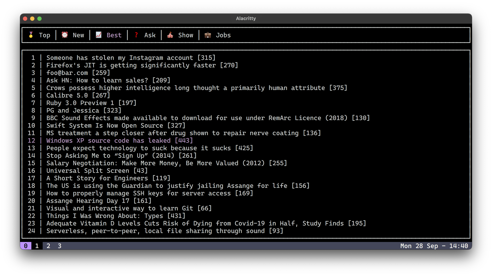

# HNTC


(Useless) [HN](https://news.ycombinator.com) Terminal Client.



## Keybindings

| Key(s) | Action |
| ------ | ------ |
| Q | Quit |
| Tab<br>RightArrow<br>L | Next tab |
| LeftArrow<br>H | Previous tab |
| Enter | Open article/linked page |
| C | Open comments page |
| UpArrow and DownArrow<br>K and J | Scroll list |

## Build from source

### Requirements

- [Rust and Cargo](https://www.rust-lang.org/tools/install)

### Build and run

```bash
# Clone
git clone https://github.com/giuuliorusso/hntc
cd hntc

# Build
cargo build --release

# Run
cargo run --release
  # or ./target/release/hntc
```

## License

[MIT](./LICENSE)
